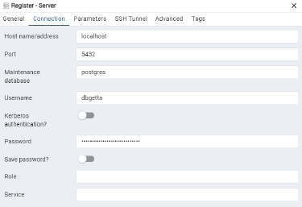

# Guide to Accessing DataGettta Database through PGAdmin

## Quick Notes

- This is assuming you have already cloned the project from GitHub and successfully run it locally on Docker.

- A good way to locally verify this is to run docker containers and then attempt to access the local site at `localhost:3000`.

## 1. Download pgAdmin

- The official pgAdmin download can be found [here](https://www.pgadmin.org/download/).

## 2. Creating a Connection

When pgAdmin is opened after installing, it displays the dashboard.

Under the 'Quick Links' section, there is a button that says 'Add New Server'.

Upon clicking "Add New Server", you will be asked to input various information about the database you want to connect to, under various tabs at the top of the window. The two tabs of importance to us are 'General' and 'Connection'.

**Note all the connection configuration information can also be found by clicking the question mark at the bottom left of the Register-Server window.**

### General

1. The Name field requires a name for the connection. Note this only for your saved connection and does not relate to the database itself only the connection. **This is required.**

2. You can leave the other fields as default, but they have useful functionality if you have multiple connections to other databases, want to leave comments, or want to wait to connect. **This is not required.**

   - You can color-code the saved connection with the background and foreground fields. These colors will affect the UI navigation, so some colors can be very unfriendly to look at.
   - You can toggle if you want to connect immediately or not.
   - You can leave comments about the connection.

3. The following is an example of the General tab configuration.

   

### Connection

1. The Host name/address field is the IP or DNS hostname of where the Postgres instance is running. For local deployment, this field is localhost.

2. The port is default at 5432, change only if you change the local configuration for the deployment.

3. The username and password is located in the db.env file. You can also toggle to save the password if you don’t want to enter it every time you make the connection.

4. The following is an example of the Connection tab configuration:

   

After you complete these two tabs, click SAVE in the bottom right corner of the window. This will open the Database in the Object Explorer on the lefthand sidebar of the screen.
